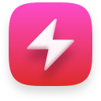

### HTML6 Studio

 

Developed by Gabriel Margarido

Tested on:
- macOS Ventura 13 - Intel: OK
- macOS Ventura 13 - Apple Silicon (M2): Ok

1. Install all dependencies:
- Ubuntu/Debian: `sudo apt install python3 lua5.1 -y`

- macOS:
    - Install Homebrew: `/bin/bash -c "$(curl -fsSL https://raw.githubusercontent.com/Homebrew/install/master/install.sh)"`  
    
    - Install Python3: `brew install python`
    
    - Install PIP: `curl https://bootstrap.pypa.io/get-pip.py | python3`

- Windows:
    - (https://www.python.org/)[www.python.org]
    - (https://gnuwin32.sourceforge.net/packages/make.htm)[GNU Make - https://gnuwin32.sourceforge.net/packages/make.htm]

2. Build from sources with:
- macOS:    `make darwin`  
- Windows   `make windows`  
- Linux:    `make linux`  

Official website: (http://html6.gabrielmargarido.org)[html6.gabrielmargarido.org]

Gabriel Margarido,
August 2023
 

